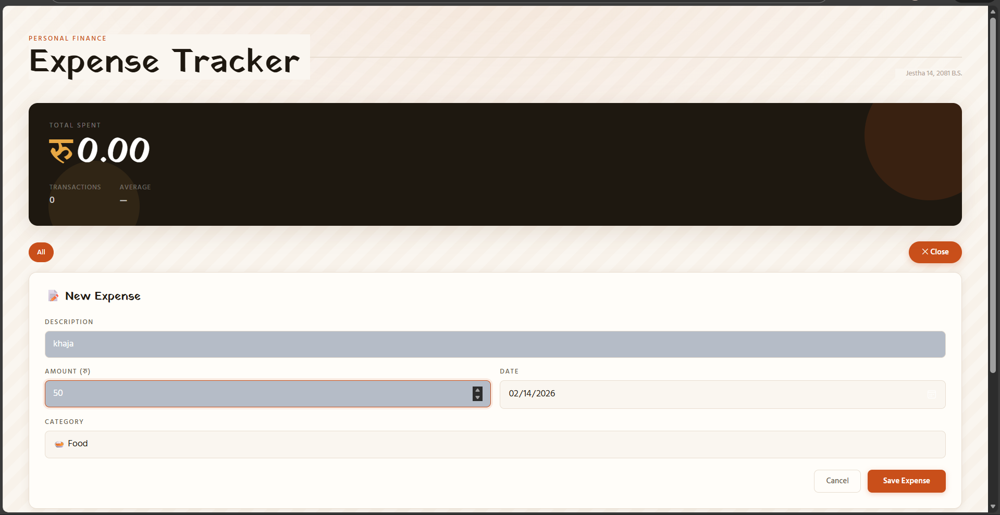
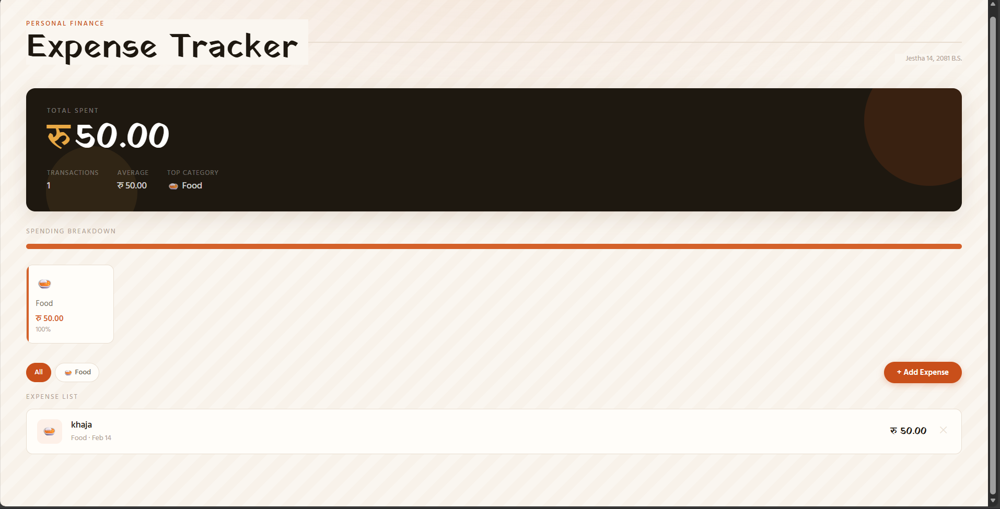
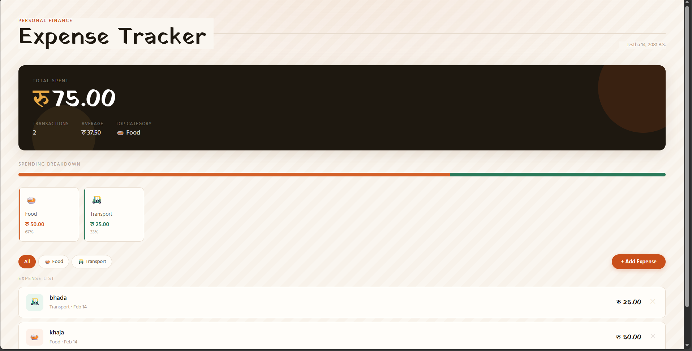

# expense-tracker-react-app-
# Expense Tracker Web App

### A React-Based Modular Web Application

---

##  Introduction

This project is a modern **Expense Tracker Web Application** developed using **React.js** and **Vite**.
The application allows users to manage daily expenses, categorize them, and dynamically calculate totals using a responsive and interactive interface.

This project demonstrates practical implementation of **React fundamentals**, modular architecture, and state management using hooks.

---

#  React Theory

## 1️⃣ What is React?

React is a **JavaScript library** developed by Facebook for building user interfaces, especially **Single Page Applications (SPAs)**.

It allows developers to create reusable UI components and efficiently update the user interface when data changes.

---

## 2️⃣ Why React is Used

* Fast rendering using Virtual DOM
* Reusable components
* Efficient state management
* Large ecosystem and community
* Suitable for scalable frontend applications

---

## 3️⃣ Single Page Application (SPA)

A Single Page Application loads a single HTML page and dynamically updates content without refreshing the page.

Benefits:

* Faster navigation
* Better user experience
* Reduced server load

---

## 4️⃣ Component-Based Architecture

React applications are built using **components**.

A component is a reusable and independent piece of UI.

Example:

```jsx
function Header() {
  return <h1>Expense Tracker</h1>;
}
```

Advantages:

* Code reusability
* Better organization
* Easier debugging
* Scalability

---

## 5️⃣ Virtual DOM

React uses a **Virtual DOM** to improve performance.

Process:

1. React creates a virtual copy of the real DOM.
2. When state changes, React updates the Virtual DOM.
3. React compares changes (Diffing algorithm).
4. Only changed elements are updated in the real DOM.

This makes React applications faster and more efficient.

---

## 6️⃣ React Hooks

Hooks allow functional components to use state and lifecycle features.

### useState()

Used to store dynamic data.

```jsx
const [expenses, setExpenses] = useState([]);
```

### useEffect()

Used to handle side effects such as data fetching.

```jsx
useEffect(() => {
  console.log("Component Mounted");
}, []);
```

---

## 7️⃣ State Management

State represents dynamic data in a component.

In this project:

* Expense data is stored in state.
* UI automatically updates when state changes.
* Data flows from parent to child components (Unidirectional Data Flow).

---

## 8️⃣ Custom Hooks

Custom hooks allow reusable logic across components.

Example:

```
useExpenses.js
```

This custom hook manages:

* Adding expenses
* Deleting expenses
* Calculating totals

---

## 9️⃣ Modular Architecture

The project follows a modular structure:

```
src/
│
├── components/
├── hooks/
├── styles/
├── App.jsx
└── main.jsx
```

Advantages:

* Clean code organization
* Separation of concerns
* Easy maintenance
* Better scalability

---

# Project Features

* Add new expenses
* Delete expenses
* Category-based filtering
* Real-time total calculation
* Responsive UI
* Smooth animations
* Modular folder structure

---

# Technologies Used

* React.js
* Vite
* JavaScript (ES6+)
* HTML5
* CSS3
* React Hooks

---
# OUTPUT





# ⚙️ Installation & Setup

### 1️⃣ Clone Repository

```bash
git clone https://github.com/your-username/expense-tracker.git
```

### 2️⃣ Navigate to Project Folder

```bash
cd expense-tracker
```

### 3️⃣ Install Dependencies

```bash
npm install
```

### 4️⃣ Run Development Server

```bash
npm run dev
```

App runs at:

```
http://localhost:5173
```

---

# Working Principle

1. User enters expense details.
2. Data is stored in React state.
3. Expense list updates automatically.
4. Total summary recalculates dynamically.
5. User can filter or delete expenses.

# Discussion
The Expense Tracker Web Application demonstrates the practical implementation of React concepts such as component-based architecture, state management using hooks, and dynamic rendering. The modular structure improved code organization and maintainability. Real-time updates of expenses and totals show how React efficiently handles UI changes using the Virtual DOM. The project also applies responsive design principles for better user experience.

# Conclusion
This project successfully implements a React-based web application using modern development practices. It strengthens understanding of components, hooks, state management, and modular architecture. The application is scalable and can be extended with backend integration and additional features in the future.
